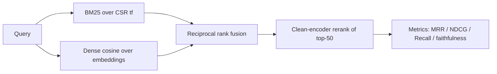
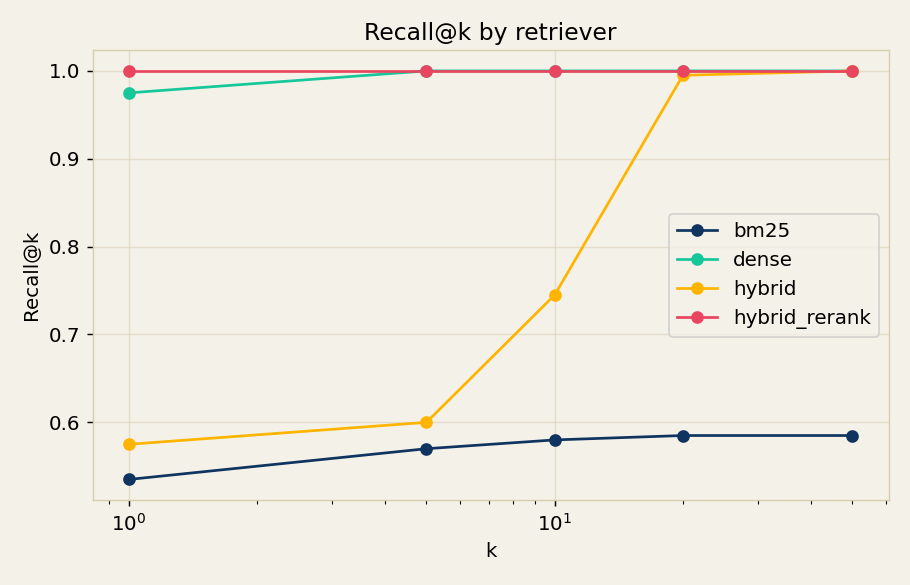
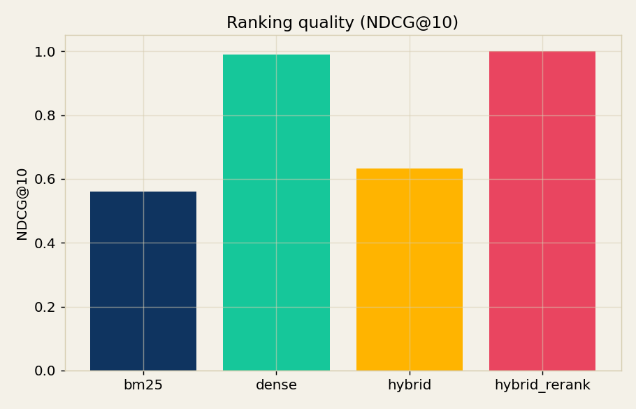
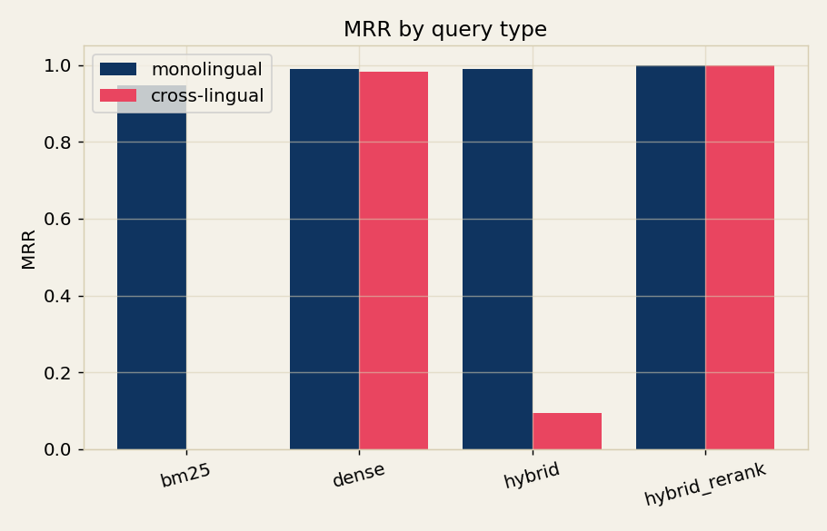
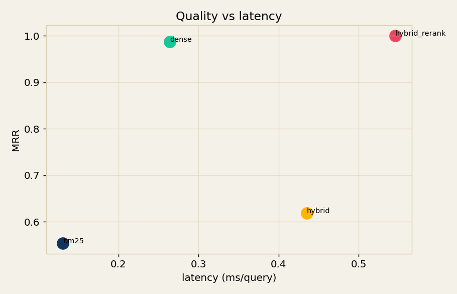
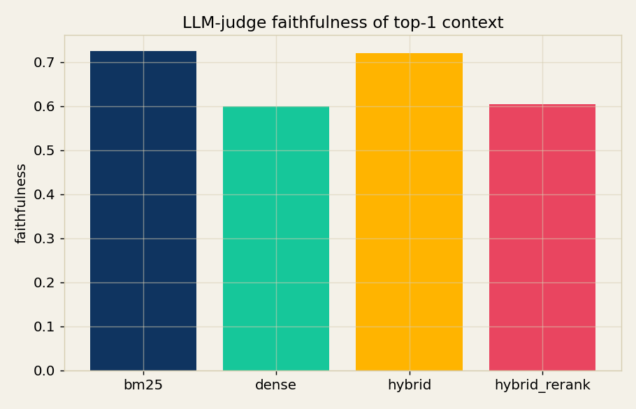
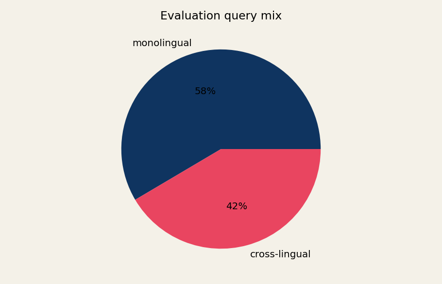

# multilingual-patent-prior-art-rag-discovery-engine


A cross-lingual prior-art retrieval benchmark. It builds a 920,000-paragraph
synthetic patent corpus across five languages and pits four retrievers against
each other: lexical **BM25**, **dense** embedding search, **hybrid** reciprocal
rank fusion, and **hybrid + rerank**. Every run is deterministic, offline, and
finishes in well under a minute on a laptop.

## The challenge

Patent examiners search prior art across languages: an English application can
be anticipated by a German or Japanese filing. Lexical search is precise within
a language but blind across them, semantic search bridges languages but blurs
near-duplicate documents, and the usual fix, "just fuse them", quietly assumes
both legs are useful on every query. This bench measures what actually happens
when half the queries are cross-lingual.

## Use case

Reach for this when you are choosing a retrieval stack for a multilingual corpus
and need a reproducible way to see how BM25, dense, fusion, and reranking trade
off before you spend money on a real embedding model and reranker.

## Headline result

920,000 paragraphs · 184,000 documents · 240 topics · 900 queries (45% cross-lingual).

| Retriever | MRR | NDCG@10 | Hit@1 | Recall@50 | MRR mono | MRR cross-lingual | Judge faithfulness |
|---|---|---|---|---|---|---|---|
| bm25 | 0.447 | 0.457 | 0.422 | 0.537 | 0.812 | 0.000 | 0.731 |
| dense | 0.859 | 0.889 | 0.782 | 1.000 | 0.875 | 0.840 | 0.525 |
| hybrid (RRF) | 0.589 | 0.610 | 0.530 | 0.998 | 0.975 | 0.116 | 0.731 |
| hybrid + rerank | **0.998** | **0.998** | **0.998** | 0.998 | **1.000** | **0.995** | 0.579 |

- **BM25 scores exactly 0.000 MRR on cross-lingual queries.** By construction the
  query shares no surface tokens with its gold document in another language, so
  the lexical leg is not weak there, it is dead.
- **Naive RRF hybrid is *worse* than plain dense** (0.589 vs 0.859 MRR). Fusing a
  dead lexical ranking into half the queries drags the blend down to 0.116 MRR on
  the cross-lingual slice. The intuition that "hybrid always helps" is wrong here.
- **Only the rerank stage recovers both worlds**, reaching 0.998 MRR overall and
  staying above 0.99 on both the monolingual and cross-lingual slices.
- **Faithfulness inverts the ranking**: BM25 and hybrid score highest on the
  token-overlap judge precisely because they retrieve same-language context. The
  judge rewards lexical overlap, which cross-lingual retrieval cannot provide, a
  reminder that lexical faithfulness metrics are biased against multilingual RAG.

## Architecture



## Chart gallery

| | | |
|---|---|---|
|  |  |  |
|  |  |  |

## Test pyramid

```
            /\        end-to-end smoke + invariant (test_runner)
           /  \
          /----\      retriever behaviour (test_models)
         /      \
        /--------\    metrics + data generation (test_metrics, test_data)
       /__________\   14 tests total
```

## Quickstart

```bash
make install      # uv sync --extra dev
make test         # 14 tests
make bench-fast   # 6k docs, ~2s
make bench        # full 920k-paragraph run, ~45s
```

The full benchmark writes `runs/latest/summary.json` and six PNGs to
`results/figures/`. Pass `--real-llm` (and install the `real-llm` extra) to swap
the offline judge for Claude.

## What is in the repo

```
src/ppa/
  types.py             DataSpec + RetrievalResult (pydantic) and the StrEnums
  data/generate.py     deterministic multilingual corpus generator (scipy CSR + numpy)
  models/retrievers.py BM25 weight matrix, dense scorer, RRF, rerank
  bench/metrics.py     MRR, NDCG@k, recall@k, hit@k, context precision
  viz/charts.py        six self-contained matplotlib charts
  llm/llm_client.py    mock + real Anthropic judge with a lexical grounding anchor
  runner.py            orchestration -> summary.json + figures
  cli/main.py          `ppa info` and `ppa bench`
```

## References

1. Robertson & Zaragoza (2009). *The Probabilistic Relevance Framework: BM25 and Beyond.*
2. Karpukhin et al. (2020). *Dense Passage Retrieval for Open-Domain QA.*
3. Cormack et al. (2009). *Reciprocal Rank Fusion Outperforms Condorcet and Individual Rank Learning Methods.*
4. Nogueira & Cho (2019). *Passage Re-ranking with BERT.*
5. Asai et al. (2021). *XOR QA: Cross-lingual Open-Retrieval Question Answering.*
6. Izacard et al. (2022). *Unsupervised Dense Information Retrieval with Contrastive Learning (Contriever).*

## License

MIT.
